# SOCIAL BUZZ DATA PROJECT

- Client name: Social Buzz
- Client industry: Social media & content creation
- Year established: 2010
- Location of HQ: San Francisco
- Number of employees: 250

**Project Brief**
---
Social Buzz emphasizes content by keeping all users anonymous, only tracking user reactions to every piece of content. There are over 100 ways that users can  react to content, spanning beyond the traditional reactions of likes, dislikes, and comments.  This ensures that trending content, as opposed to individual users, is at the forefront of user  feeds.   Over the past 5 years, Social Buzz has reached over 500 million active users each month.  They have scaled quicker than anticipated and need the help of an advisory firm to oversee  their scaling process effectively.   Due to their rapid growth and the digital nature of their core product, the amount of data that they  create, collect and analyze is huge. Every day, over 100,000 pieces of content, ranging from text, images, videos and GIFs, are posted. All of this data is highly unstructured and requires extremely sophisticated and expensive technology to manage and maintain. Of the 250 people working at Social Buzz, 200 are technical staff working on maintaining this highly complex technology.   They are still a small company and do not have the resources to manage the scale that they are currently at. Due to the nature of their business, they have a massive amount of data, so they are keen on  understanding how the world's biggest companies manage the challenges of big data.

**_Disclaimer_**: _All datasets and reports are from Accenture's Data Analytics and Visualisation Project, not mine._

## Problem Statement

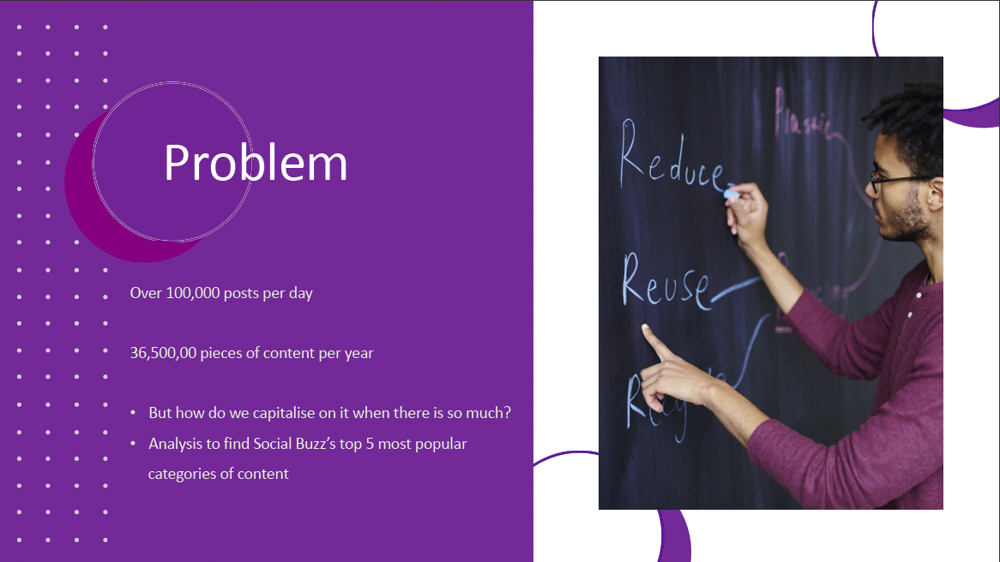
1. How many unique Content Categories are in the data?
2. What are the Top 5 Content Categories with the largest aggregate popularity?
3. Which month has the highest number of posts?
4. What insights can you derive from the data to advise Social Buzz?

## Skills/Concepts demonstrated
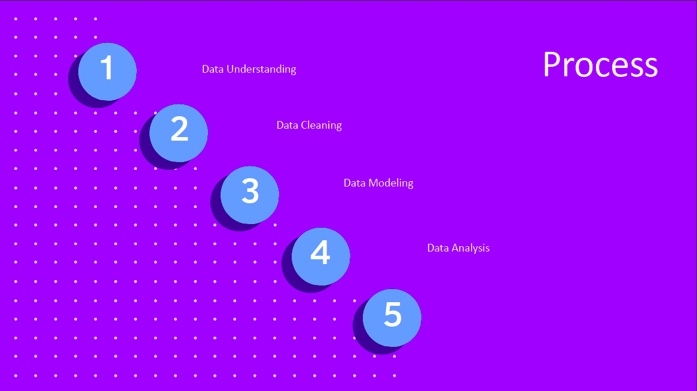

## Dataset
- 7 datasets

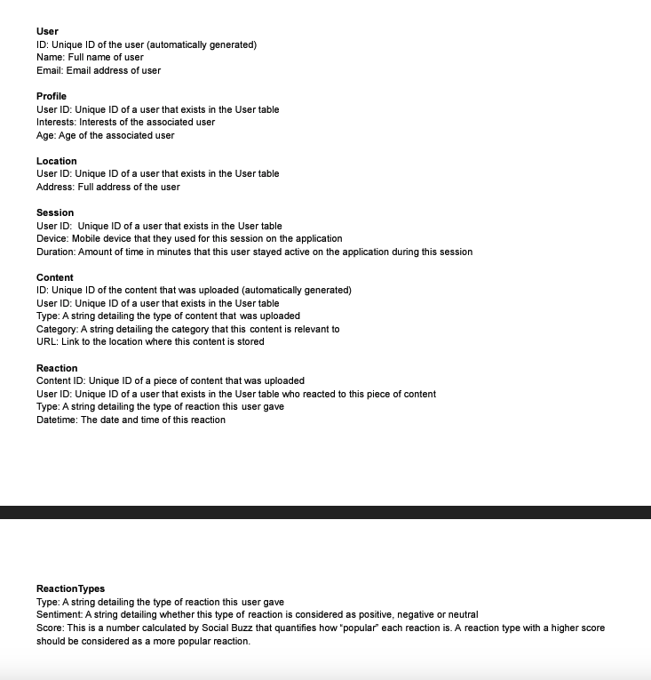  

## Data Model
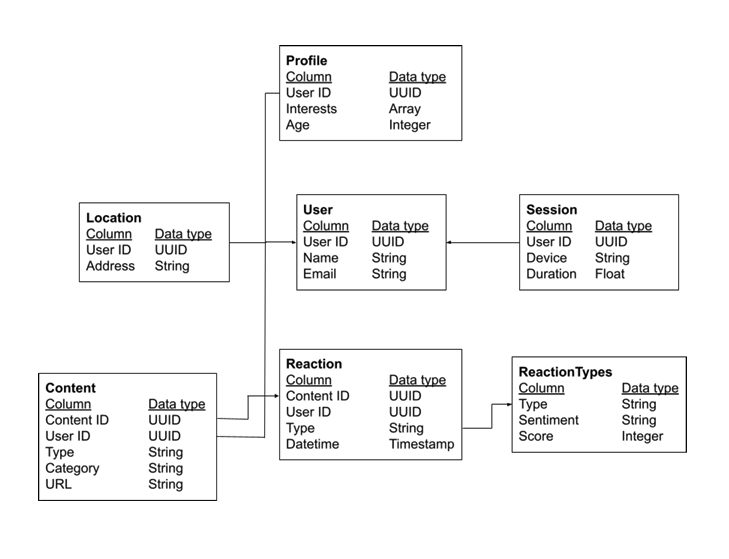

### Data Sets Used
- Content
- Reaction Type
- Reactions
---
### Data Cleaning

Clean the data by:
- removing rows that have values which are missing,
- changing the data type of some values within a column and
- removing columns which are not relevant to this task.

### Data Modelling
1. Create a final data set by merging the three tables together with XLookUp.
2. Using the Reaction table as my base table, I first joined the relevant columns from the Content data set and then the Reaction Types data set with XLookUp.
3. Figured out the Top 5 performing categories using the COUNTIF formula.
4. Number of Unique categories using the CountA(Unique)formula.
---

### No. of Unique Categories 

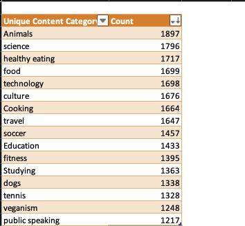         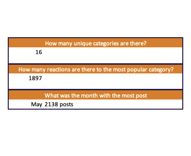  

### Top 5 Content Categories

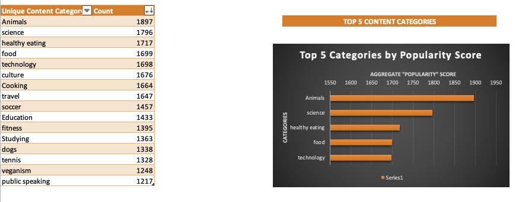

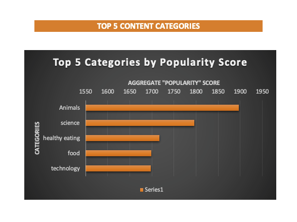  

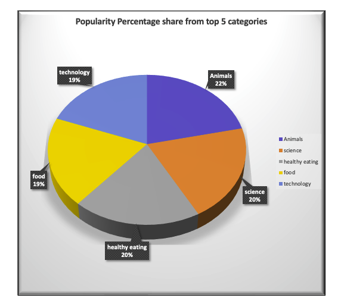   

### Month with the highest number of posts

 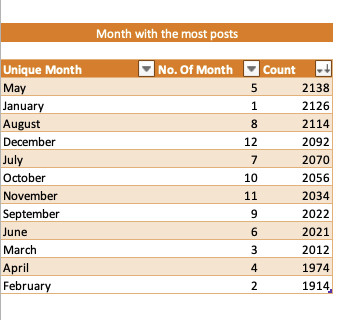
 
---

### Insights
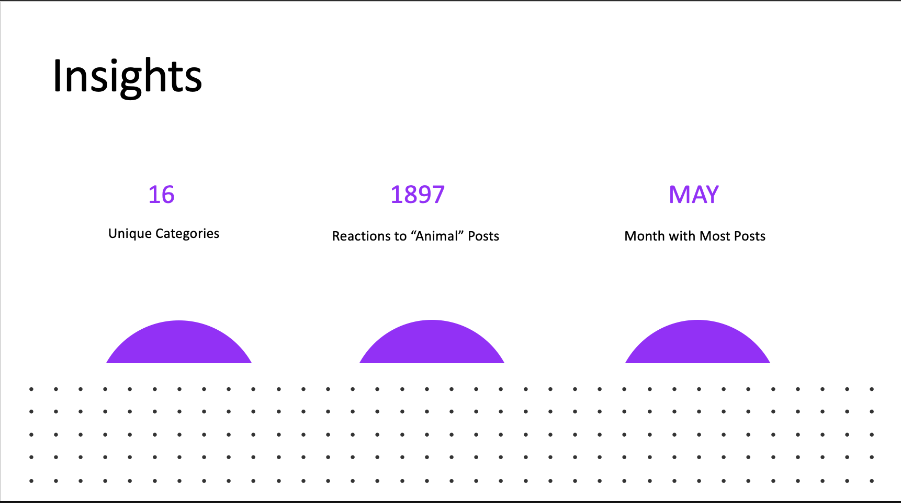  

- The top 5 most popular categories of posts were animals, science, healthy eating, technology and food in descending order.
- For the % split of popularity between the top 5 categories, there is not much difference between the share of each category, however, the difference between the 1st most popular, animals and the 2nd most popular, science, is the largest gap equal to 1.1%.
- Food and healthy eating within the top 5 shows that food is a highly engaging content category.
- Healthy eating ranks slightly higher than food, so perhaps Social Buzz's user base may be skewed towards healthy eaters and health-conscious people.
- Finally, science and technology may suggest that people enjoy consuming factual content and snippets of content that they can learn something from.

---

## Analysis and Recommendations
- 'Animals' and 'Science' are the two most popular content categories, showing that consumers enjoy 'real-life' and 'factual' content the most.
- 'Food' and 'Healthy eating' in the top 5 may give an indication about the consumer base. Social Buzz could run a campaign with content focused on this category or work with healthy eating brands to promote content.

---

